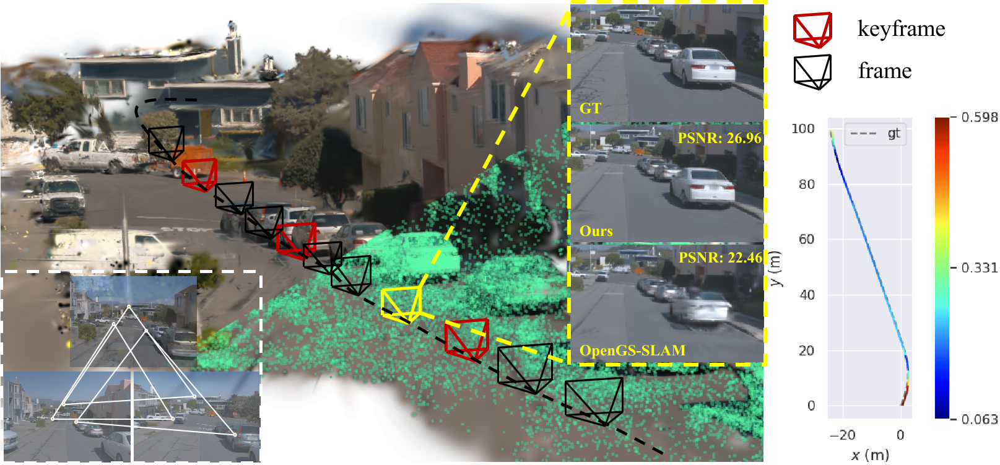
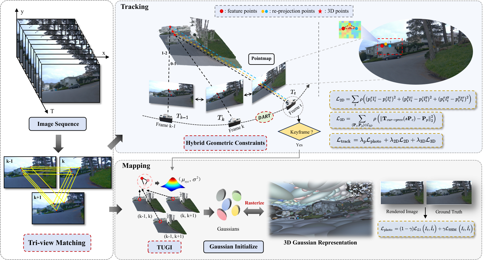

# TVG-SLAM

[](https://ieeexplore.ieee.org/document/11278701) [](https://arxiv.org/pdf/2506.23207v1)

<div align="center">  </div>

---

## 🌟 Overview

<div align="center">  </div>

The official implementation of **"TVG-SLAM: Robust Gaussian Splatting SLAM with Tri-view Geometric Constraints"**.

### 📄 Highlights:
- **Robust Gaussian Splatting SLAM**
- **Tri-view Geometric Constraints**
- Accepted by **IEEE Robotics and Automation Letters (RA-L)** 🎉🎉

---

## 📚 Citation
If you find this work useful in your research, please consider citing us:

```bibtex
@ARTICLE{tan2025ral-tvgslam,
  journal={IEEE Robotics and Automation Letters (RA-L)},
  title={TVG-SLAM: Robust Gaussian Splatting SLAM with Tri-view Geometric Constraints},
  author={Tan, Zhen and Chen, Xieyuanli and Feng, Lei and Ge, Yangbing and Zhi, Shuaifeng and Liu, Jiaxiong and Hu, Dewen},
  year={2025}
}
